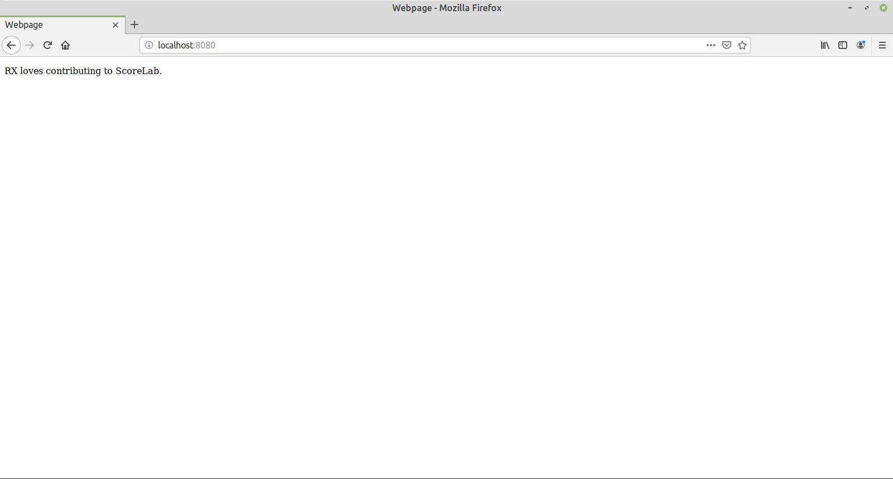

# Simple Python Web Server

A simple demonstration of using Python to create a HTTP server.

## Installation
Simple:
```
git clone https://www.github.com/lawruixi/Simple-Python-Web-Server
```

## Usage
```
cd Simple-Python-Web-Server
```


Then either do
```
python3 server.py
```
or
```
python3 -m http.server 8080
```
or
```
python -m SimpleHTTPServer 8080
```
_(if only Python 2 is installed)_

Then visit http://localhost:8080.
